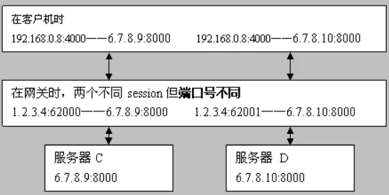

## NAT

模拟情形：位于网络A下的内网主机UserA 想要和位于网络B下的内网主机UserB进行点对点通信，刚开始的时候UserA和UserB都不知道对方的公网和内网IP地址及端口号，所以必须要再公网上搭建一个服务器C，服务器C主要的任务就是维护一张用户名到（主机的公网IP+端口号）的映射表，这样用户就可以从服务器C上获取UserB的公网IP和地址。

UserA在局域网内发的IP包源地址是192.168.1.100:3000，该IP包经过路由器A后会被路由器A修改成能够在公网传输的公网IP地址和公网端口号：125.71.229.217:4001。UserB向公网发送报文路由器B也会对它做同样处理。

#### nat穿越：

STEP1: 假设UserA想要给UserB发送消息，那么UserA就会让服务器C通知UserB先进行打洞操作。

STEP2： UserB收到打洞通知后，就发送IP包（目地址：125.71.229.217:4001，源地址：202.108.22.5:6002）给路由器A。路由器A收到该IP包后会查看源地址（202.108.22.5:6002），路由器发现局域网之前没有请求过该源地址，所以路由器会过滤掉此包。（这一步就相当于打了个洞）

STEP3： 现在到了最后UserA给UserB发送消息的一步，UserA通过路由器A发出IP数据包（目地址：202.108.22.5:6002，源地址：125.71.229.217:4001）给路由器B，同样路由器B要查看该IP包的源地址（125.71.229.217:4001），因为在STEP2中路由器B给路由器A发送过对此地址的请求（最后被丢掉的那个包），所以路由器B不会丢掉该包。接下来路由器B会读取IP包的目的地址202.108.22.5：6002，然后通过映射表转换成内网IP地址和端口号：192.168.1.100:3000，这样就可以发送报文给主机UserB了。

**实际上上面的nat穿越技术只适合锥形路由器（非对称路由器）**，说道这就要讲一下什么是对称路由器和非对称路由器了：

* 非对称路由器：将同一内网IP （比如：192.168.1.100:3000） 访问不同外网地址比如百度和谷歌时映射成的公网IP和公网端口是相同的（比如都是：202.108.22.5:6002）。
* 反之，对称路由器就是：将同一内网IP（比如192.168.1.100:3000）访问不同网络地址比如百度和谷歌时映射成的公网IP和公网端口是不同的（比如访问百度时映射成：202.108.22.5:6002，访问谷歌时映射成：125.71.229.217:4001）

回到讲的nat穿越技术，显然，**UserA想给UserB发送消息，前提是：UserB 给UserA发送消息（打洞操作）和UserB给服务器C发送消息（注册自己的公网IP）用的公网IP地址和端口号是相同的。**所以nat穿越只适合非对称路由器。

> 不能用TCP做nat穿越，只能用UDP做nat穿越。
>
> 因为：tcp是基于连接的通信，而路由器会把来自同一主机的同一端口号上的不同tcp连接映射成不同的公网端口号。反之，UDP不是基于连接的传输协议，所以使用UDP就可以将不同的网络请求映射成同一公网源地址和公网端口号。
>
> 体现到实际编程中就是：同一文件描述符通过路由器可以映射成同一公网IP地址和端口号。不同文件描述符通过路由器要被映射成同一公网地址和不同的公网端口号。UserA 和 服务器C通信（注册自己的公网IP）时，需要创建一个文件描述符 fd1；UserA 和 UserB通信时还要再创建一个描述符 fd2。 路由器对不同描述符做映射时，会把不同的描述符映射到不同的公网端口号上。
>
> 比如：UserA 的文件描述符fd1 绑定到了端口3000上，文件描述符 fd 通过端口复用也绑定到了端口3000上；但路由器在做映射时，会将这两个文件描述符代表的tcp连接映射成如下格式（eg:） 192.168.1.100:3000 <->202.108.22.5:6002; 192.168.1.100:3000 <-> 202.108.22.5:6003
>
> **使用UDP可以完成nat穿越，因为UserA 通过文件描述符fd1 和 服务器C通信，然后UserA可以继续用此fd1和UserB通信，这样路由器就会把同一内网地址上的同一端口号发出的请求映射成同一公网地址。**

先做一个约定：

内网A中有：**A1（192.168.0.8）**、**A2（192.168.0.9）**两用户

网关**X1**（一个NAT设备）有公网IP **1.2.3.4**

内网B中有：**B1（192.168.1.8）**、**B2（192.168.1.9）**两用户，

网关**Y1**（一个NAT设备）有公网IP **1.2.3.5**

公网服务器：**C (6.7.8.9) D (6.7.8.10)**

**NAT原理简介**

网络地址转换(NAT,Network Address Translation)属接入广域网(WAN)技术，是一种将私有（保留）地址转化为合法IP地址的转换技术。下面介绍两类不同方式实现的NAT：

**1. NAT(Network Address Translators)：称为基本的NAT**

在客户机时192.168.0.8:4000——6.7.8.9:8000

在网关时1.2.3.4:4000——6.7.8.9:8000

服务器C 6.7.8.9:8000

**其核心是替换IP地址而不是端口**，具体参考RFC 1631。基本上这种类型的NAT设备已经很少了,或许根本我们就没机会见到。

**2.  NAPT(Network Address/Port Translators)：其实这种才是我们常说的 NAT**

为了更有效地利用NAT路由器上的全球IP地址，现在常用的NAT转换表把运输层的端口号也利用上。这样，就可以使多个拥有本地地址的主机，共用一个NAT路由器上的全球IP地址，因而可以同时和互联网上的多台主机进行通信。

NAPT的特点是在网关时，会使用网关的 IP，但端口会选择一个和临时会话对应的临时端口。如下图：

在客户机时192.168.0.8:4000——6.7.8.9:8000

在网关时1.2.3.4:62000——6.7.8.9:8000

服务器C        6.7.8.9:8000

网关上建立保持了一个1.2.3.4:62000的会话，用于192.168.0.8:4000与6.7.8.9:8000之间的通讯。

**对于NAPT，又分了两个大的类型**

   **2.1Symmetric NAT型 (对称型)**

在客户机时192.168.0.8:4000——6.7.8.9:8000 192.168.0.8:4000——6.7.8.10:8000

在网关时，两个不同session但端口号不同1.2.3.4:62000——6.7.8.9:8000 1.2.3.4:62001——6.7.8.10:8000

服务器C   6.7.8.9:8000

服务器D   6.7.8.10:8000

这种形式会让很多p2p软件失灵。

**2.2、Cone NAT型（圆锥型）**

在客户机时192.168.0.8:4000——6.7.8.9:8000     192.168.0.8:4000——6.7.8.10:8000

在网关时，两个不同session但端口号相同1.2.3.4:62000——6.7.8.9:8000   1.2.3.4:62000——6.7.8.10:8000

服务器C      6.7.8.9:8000

服务器D      6.7.8.10:8000

目前绝大多数属于这种。

**Cone NAT又分了3种类型：**

a)**Full Cone NAT（完全圆锥型）**：从同一私网地址端口192.168.0.8:4000发至公网的所有请求都映射成同一个公网地址端口1.2.3.4:62000 ，192.168.0.8可以收到任意外部主机发到1.2.3.4:62000的数据报。

]b)**Address Restricted Cone NAT（地址限制圆锥型）**：从同一私网地址端口192.168.0.8:4000发至公网的所有请求都映射成同一个公网地址端口1.2.3.4:62000，只有当内部主机192.168.0.8先给服务器C 6.7.8.9发送一个数据报后，192.168.0.8才能收到6.7.8.9发送到1.2.3.4:62000的数据报。

c)**Port Restricted Cone NAT（端口限制圆锥型）**：从同一私网地址端口192.168.0.8:4000发至公网的所有请求都映射成同一个公网地址端口1.2.3.4:62000，只有当内部主机192.168.0.8先向外部主机地址端口6.7.8.9：8000发送一个数据报后，192.168.0.8才能收到6.7.8.9：8000发送到1.2.3.4:62000的数据报。  

**穿越NAT的实现**

A1在客户机时        192.168.0.8:4000——6.7.8.9:8000

X1在网关时          1.2.3.4:62000——6.7.8.9:8000

服务器C            6.7.8.9:8000

B1在客户机时        192.168.1.8:4000——6.7.8.9:8000

Y1在网关时          1.2.3.5:31000——6.7.8.9:8000

两内网用户要实现通过各自网关的直接呼叫，需要以下过程：

1、 客户机A1、B1顺利通过各自网关访问服务器C ，均没有问题（类似于登录）

2、 服务器C保存了 A1、B1各自在其网关的信息（1.2.3.4:62000、1.2.3.5:31000）没有问题。并可将该信息告知A1、B2。

3、 此时A1发送给B1网关的1.2.3.5:31000是否会被B1收到？答案是基本上不行（**除非Y1设置为完全圆锥型**，但这种设置非常少），因为Y1上检测到其存活的会话中没有一个的目的IP或端口与1.2.3.4:62000有关而将数据包全部丢弃！

4、 此时要实现A1、B1通过X1、Y1来互访，需要服务器C告诉它们各自在自己的网关上建立“**UDP隧道**”，即命令A1发送一个 192.168.0.8:4000——1.2.3.5:31000的数据报，B1发送一个192.168.1.8:4000——1.2.3.4:62000的数据报，UDP形式，这样X1、Y1上均存在了IP端口相同的两个不同会话（很显然，这**要求网关为Cone NAT型--地址限制锥型或端口限制锥型）**，否则，对称型Symmetric NAT设置网关将导致对不同会话开启了不同端口，而该端口无法为服务器和对方所知，也就没有意义）。

5、 此时A1发给Y1，或者B1发给X1的数据报将不会被丢弃且正确的被对方收到.

综合P2P可实现的条件需要：

1、 中间服务器保存信息、并能发出建立UDP隧道的命令

2、 网关均要求为Cone NAT类型。Symmetric NAT不适合。

3、 完全圆锥型网关可以无需建立udp隧道，但这种情况非常少，要求双方均为这种类型网关的更少。

4、 假如X1网关为Symmetric NAT， Y1为Address Restricted Cone NAT 或Full Cone NAT型网关，各自建立隧道后，A1可通过X1发送数据报给Y1到B1(因为Y1最多只进行IP级别的甄别)，但B1发送给X1的将会被丢弃（因为发送来的数据报中端口与X1上存在会话的端口不一致，虽然IP地址一致），所以同样没有什么意义。

5、 假如双方均为Symmetric NAT的情形，新开了端口，对方可以在不知道的情况下尝试猜解，也可以达到目的，但这种情形成功率很低，且带来额外的系统开支，不是个好的解决办法。

6、 不同网关型设置的差异在于，对内会采用替换IP的方式、使用不同端口不同会话的方式，使用相同端口不同会话的方式；对外会采用什么都不限制、限制IP地址、限制IP地址及端口。

**一些现在常用的技术：**

**ALG（应用层网关）**：它可以是一个设备或插件，用于支持SIP协议，主要类似与在网关上专门开辟一个通道，用于建立内网与外网的连接，也就是说，这是一种定制的网关。更多只适用于使用他们的应用群体内部之间。

**UpnP**：它是让网关设备在进行工作时寻找一个全球共享的可路由IP来作为通道，这样避免端口造成的影响。要求设备支持且开启upnp功能，但大部分时候，这些功能处于安全考虑，是被关闭的。即时开启，实际应用效果还没经过测试。

**STUN（Simple Traversalof UDP Through Network）：**这种方式即是类似于我们上面举例中服务器C的处理方式。也是目前普遍采用的方式。但具体实现要比我们描述的复杂许多，光是做网关Nat类型判断就由许多工作，RFC3489中详细描述了。

**TURN(Traveral Using Relay NAT)：**该方式是将所有的数据交换都经由服务器来完成，这样NAT将没有障碍，但服务器的负载、丢包、延迟性就是很大的问题。目前很多游戏均采用该方式避开NAT的问题。这种方式不叫p2p。

**ICE(Interactive Connectivity Establishment)：**是对上述各种技术的综合，但明显带来了复杂性。

NAT：通过公网IP地址与端口一起映射到私网IP与端口。

> DNS占用53号端口，同时使用TCP和UDP协议。那么DNS在什么情况下使用这两种协议？
>
> DNS在区域传输的时候使用TCP协议，其他时候使用UDP协议。
>
> **DNS区域传输的时候使用TCP协议：**
>
> 1.辅域名服务器会定时（一般3小时）向主域名服务器进行查询以便了解数据是否有变动。如有变动，会执行一次区域传送，进行数据同步。区域传送使用TCP而不是UDP，因为数据同步传送的数据量比一个请求应答的数据量要多得多。
>
> 2.TCP是一种可靠连接，保证了数据的准确性。
>
> **域名解析时使用UDP协议：**
>
> 客户端向DNS服务器查询域名，一般返回的内容都不超过512字节，用UDP传输即可。不用经过三次握手，这样DNS服务器负载更低，响应更快。理论上说，客户端也可以指定向DNS服务器查询时用TCP，但事实上，很多DNS服务器进行配置的时候，仅支持UDP查询包。

使用NAV的优势：

* 节省服务器带宽

